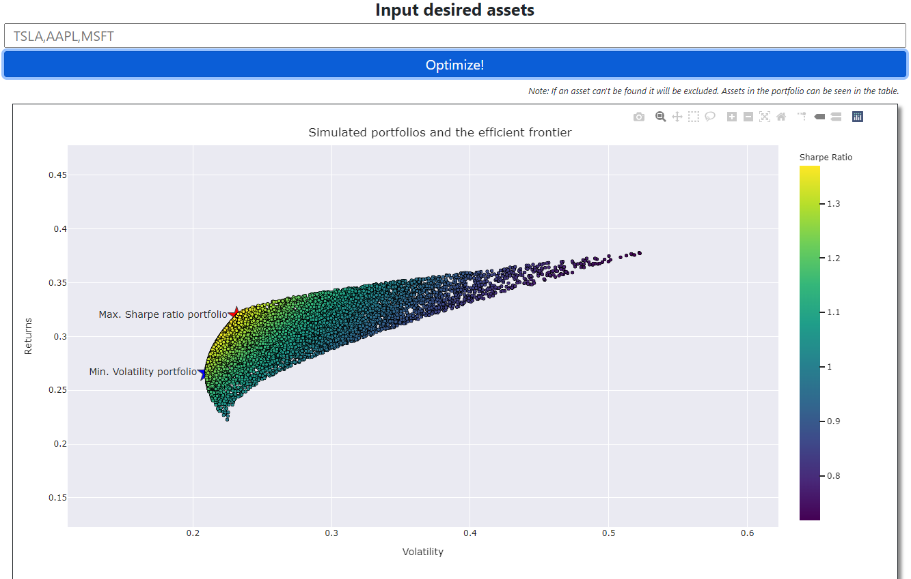
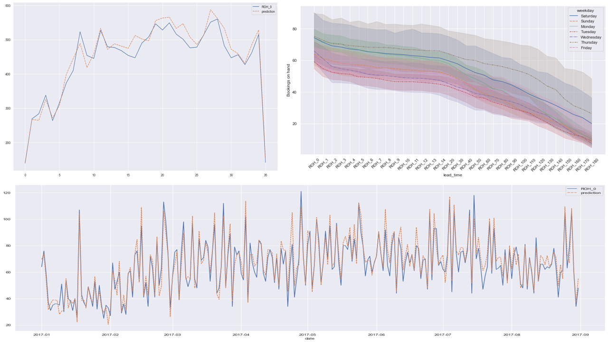
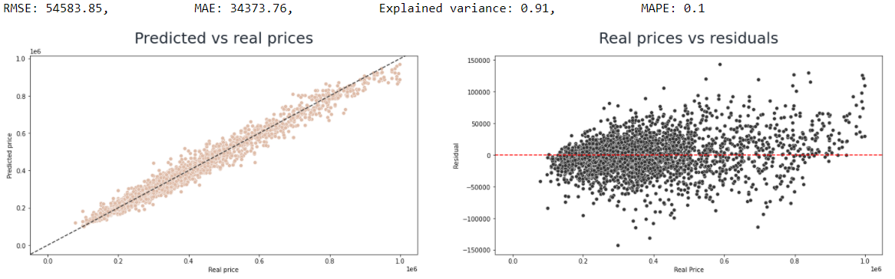
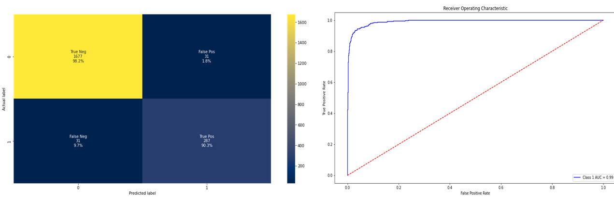
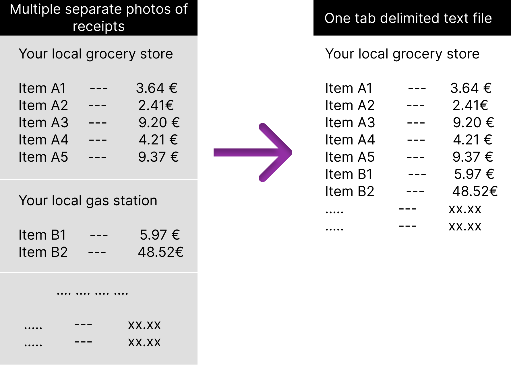
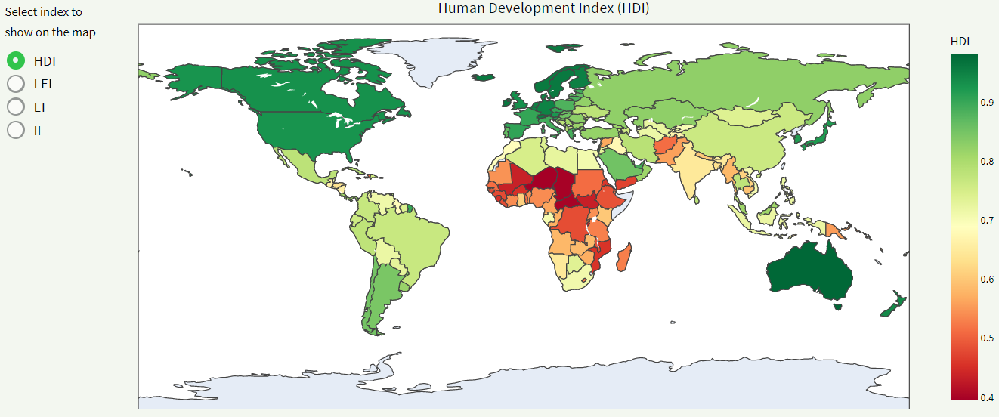
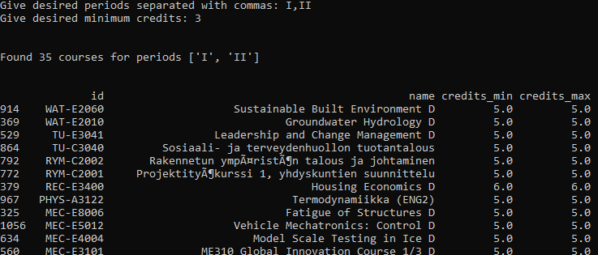

# Portfolio
---
<!--  -->
<!-- 
This portfolio is a compilation of projects and notebooks which I have created for data analysis or exploration of machine learning algorithms.
 -->
## Stand-alone projects

### Automatic Data Imputer app [Work in progress]

Imputing missing values is a common task for people working with data. To ease this, I created an app where users can impute their data using simple and complex models. This allows users to focus on more important problems than data wrangling and setting up python environments. At the moment, there are two models implemented: SimpleImputer which fills missing values with the column mean, median or mode, and XGBImputer which uses XGBoost for learning and predicting the missing values. Be aware that this work is still in progress and slow imputation and timeouts are to be expected, especially for large datasets.

--- 

### Portfolio Optimization

The purpose of this project was to create a simple interactive tool to optimize the asset allocation of a stock portfolio. I wanted to do an automatic data retrieval from Yahoo Finance and optimize the asset portfolio using my knowledge of portfolio optimization and investment science. [Markowitz model](https://en.wikipedia.org/wiki/Markowitz_model) was used for the implementation. Most of the difficulties came from learning frontend development (Flask, JS, HTML) from scratch and from using Google Cloud Platform (GCP).

--- 

## Regression

### Hotel booking demand prediction

Demand prediction is an important part of revenue management. It is used to inform decision-makers about the resource demand and help them optimize revenue. The main idea of the analysis is to implement a method of predicting the final reservation count on the date of arrival, using the booking curves as the features. As the reservations are usually done beforehand, the decision-makers always have the current Reservations On Hand (ROH). These ROHs are the time series that create the booking curves until the arrival date.   
The model implemented in this analysis is XGBoost, which takes 180 features and outputs the final reservation count. XGBoost is used due to its ability to natively handle missing values, which the booking curves will always have. This is better than fitting multiple models for different booking curve lengths. After optimizing the hyperparameters, the model performs quite well. It can predict the next week's daily reservation counts with a MAPE of 8%, and MAE of 5 reservations. Using this demand prediction, the hotel managers could optimize their resource allocation, such as room cleaning staff or reception hours for each day, saving money and increasing profits.

---

### Finnish house & apartment prices EDA and prediction

The purpose of this analysis is to look at real data from the capital area of Finland regarding multiple types of houses and apartments. We got the data using our self-built data scraper for Finnish house listings ([see here](https://github.com/johmakinen/Various_projects/blob/main/Notebooks/house_scraper.ipynb)). Then we performed Exploratory Data Analysis to see what insights we could get from the data. Afterwards, we implemented several models to predict the price of a house using given features like size, the year it was built and the area which it is within the Helsinki metropolitan area.   
Our models performed quite well, most notably the two-model approach, where we fit two models: one for low priced houses and one for the rest. The explained variance for each of the models was almost 90%. Though improvements could still be made, as there is some heteroscedasticity seen on the residual plots.
This analysis and these models have the potential to be used to on giving suggestion prices for people who are selling their houses.
This could also be used by potential house buyers to see if the house they are looking at has the features to match the price, or if the seller trying to overprice the listing.

---

## Classification

### Predict churning customers

In this analysis, I explored a [dataset](https://www.kaggle.com/sakshigoyal7/credit-card-customers) of credit card customers and then created a Gradient Boosting Classifier to predict whether a customer would be churning out. This is an important task for many businesses because you can directly improve profits if you can improve customer retention. Using my model, we could target the customers that are predicted to churn out, and give them more benefits or target them with lucrative campaigns so that they would not drop out. The implemented model has high accuracy (both Precision & Recall > 90%), but is also simple enough to be understood easily. Upsampling was used to tackle the problem of highly imbalanced data.

---

## Miscellaneous

### House price data scraper

I was not content with the data on house prices available in Finland, and thus I created a web scraper that could extract the prices of houses and apartments in any city of Finland. The scraper uses Selenium for the scraping and is implemented with an Object-Oriented Programming style. The data is then stored in an SQLite database for later use. The scraper is implemented in a notebook and not in a separate .py-file, as it is simpler to follow the implementation. The hardest part of this project was the inconsistency of the data. You could have wildly different house listing information for each house, so I had to come up with error handling. This was particularly important as I didn't want to waste time losing thousands of observations due to an error.

---

### Receipt reader

A small Python script that scans a photo/pdf of a shopping receipt, and then extracts the items and the prices. It collects all the information from multiple separate photos into one tab-delimited text file, which can then be easily read and used with other tools. This tool utilises [ASPRISE](http://asprise.com/)'s Optical Character Recognition (OCR) test API. Though the test API is for limited use only, this tool suffices for my monthly receipt gathering and expense monitoring.

---

### Multiple Correspondence Analysis on sleeping pads (MCA)

I was in search of a new sleeping pad for my hiking trips. As a quite perfectionist, I usually want to analyse all the things that I'm about to buy, so that I'm not let down, waste money on subpar equipment or otherwise feel bad about my purchase later. Therefore, I analysed some common sleeping pads and figured out what kind of a pad would be a good buy. To do this, I preprocessed the data and applied [MCA](https://en.wikipedia.org/wiki/Multiple_correspondence_analysis) to get insights into the underlying structure of the data.

---

### Dashboard for Human Development Index

This was mostly a learning project. The goal was to 1. Implement and deploy a dashboard app using Streamlit, 2. Apply small unit tests, 3. Test a new folder structure for stand-alone projects. All of these goals were achieved, and the dashboard is up and running. Streamlit was amazingly simple to use and deploy, as it is intended to be. Though, the cost of such simplicity is the loss of flexibility. Unit tests were quite naive and small, but at the time of writing this, I was doing lots of unit tests for my High Performance Computing course and wanted to apply them in my projects. The new folder structure is more efficient to use and it keeps the structure of the whole project coherent. I sense that I will be using this structure for future projects.

---

### Course search tool for my university

At the time of creation, you could not search courses for only certain periods. You could only search for courses that overlap the period you were searching; e.g. the problem was: "I want to see courses only in period 1, not courses that are in period 1 AND 1-2". This made my life much harder when trying to plan my courses ahead of time. Thus, I created a better way to search for courses at my university. The tool doesn't work for *you* as the university didn't allow me to publish the course data, but you can see the pipelines that I've created.

---

### Optimal flight with a glider

This was a quite large school-related project, where we optimized the flight path (control policy) of a hang glider in different situations. The objective was to maximize the length of the glide in the direction of the x-axis. The project utilized dynamic optimization (control theory) and simulation using Matlab. [Direct collocation](https://en.wikipedia.org/wiki/Trajectory_optimization#Direct_collocation) and [Sequential quadratic programming](https://en.wikipedia.org/wiki/Sequential_quadratic_programming) were used to make the method more efficient.

---

